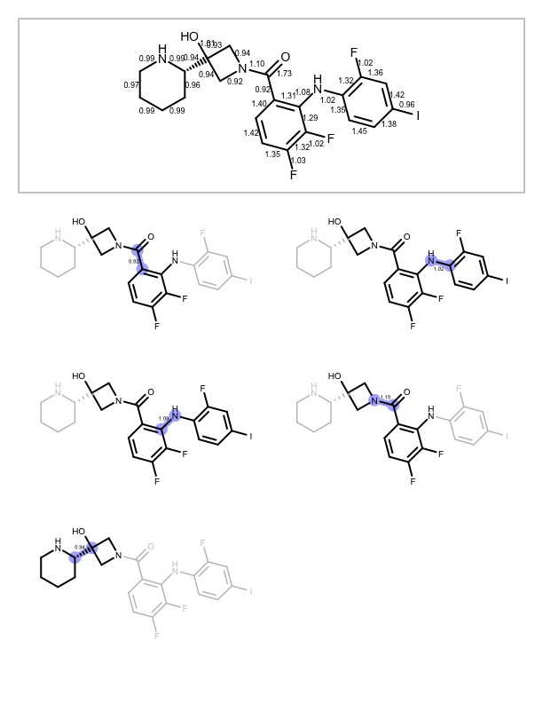

Examples
========

Below is an example on how to use ``fragmenter`` to fragment a molecule. It is also available in the `examples
folder <https://github.com/openforcefield/fragmenter/tree/master/examples>`_

.. literalinclude:: ../examples/fragment_molecules.py
    :language: python

Below are the fragments this script generated and the output you get by calling ``fragment_engine.depict_fragments()``

